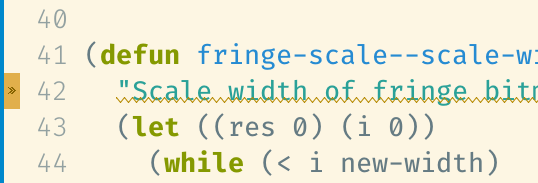
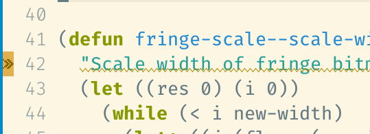

## fringe-scale

Emacs fringes are usually small in HiDPI screen because they are defined as bitmaps in fixed width (see below).



This package scales them (see below).




### Usage

```
(set-fringe-mode 16)

(require 'fringe-scale)
(fringe-scale-setup)
```

See the document for more details.
